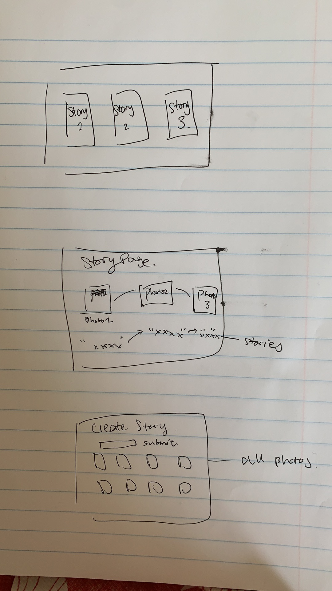
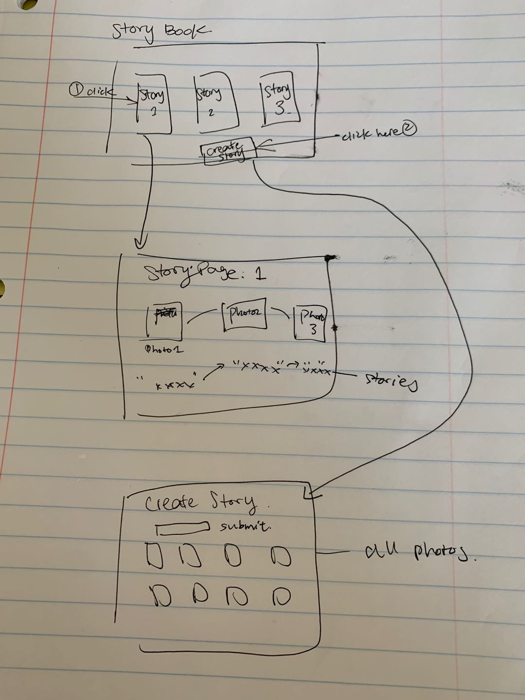

The content below is an example project proposal / requirements document. Replace the text below the lines marked "__TODO__" with details specific to your project. Remove the "TODO" lines.


# Photography Exhibit

## Overview

I want to design an picture website that exhibits awesome photos. 

User can upload their own images to the web app.  as a form of story. User can also add their messages to make the story more instresting.


    
            


## Data Model


The application will store Users, Images,Stories:

* 1 Story can only have 1 User
* 1 Image can only have 1 User 
* 1 Story can have many Images(embedding)


An Example User:
 
```javascript
{
 username: "sylvie",
 salt:
 hash:"sadsadxasxasd638628" //encrypted password
}
```
An Example Image:
```javascript
{
 imgName: "cuba"
 imgURL: "xxxx"
 imgMessage: "this pumpkin is tasteful",
 user: User,
}

```

An Example Story:
```javascript
{
    storyName: "cuba"
    imgList:[{
            imgName: "cuba"
            imgURL: "xxxx"
            imgMessage: "this pumpkin is tasteful",
            user: User,
        },
        
        {
            imgName: "china"
            imgURL: "xxxx"
            imgMessage: "this egg is tasteful",
            user: User,
    }],
    user: User,
}

```


## [Link to Commented First Draft Schema](db.js) 


## Wireframes

/storybooks  => allows user to see every stories created (ONLY LOGGED IN USER can access)
/allimages   => allows user to see every images uploaded (ONLY LOGGED IN USER can access)
/mystories   => allow user to only see his/her own story (ONLY LOGGED IN USER can access)
/create      => allow user to create a story with 3 images (ONLY LOGGED IN USER can access) 


/login      => allow registered user to log in.
                (LOGGED IN USER WON'T BE ABLE TO ACCESS THIS PAGE)
/register   => allow new user to register. If successful, user will be directly logged in.
                (LOGGED IN USER WON'T BE ABLE TO ACCESS THIS PAGE)


/logout     => to log out account

        



## Site map



## User Stories or Use Cases


1. as non-registered user, I can register a new account with the site
2. as a user, I can log in to the site
3. as a user, I can create my own story uploading pictures and messages
4. as a user, I can view  storybook(all stories), all images, as well as my story on the site
5. as a user, I can only see me own story in /mystories, but not other people's stories


## Research Topics

 
* (5 points) Integrate user authentication
    * I want to try having user account and their own stories , and I want to make user data private in one page
    * The whole website can only be viewed by logged in user
* (3 points) bootstrap
    * I want to make my website look prettier and more organized
    * I utilized concepts: button, card, display-2, container, row, col ... etc
    * created my own theme

8/8 point

## [Link to Initial Main Project File](app.js) 


## Annotations / References Used


1. [passport.js authentication docs](http://passportjs.org/docs) - [youtube link](https://www.geeksforgeeks.org/login-form-using-node-js-and-mongodb/)
2. [tutorial on boostrap](https://getbootstrap.com/docs/4.5/getting-started/introduction/) - (https://www.youtube.com/watch?v=c9B4TPnak1A&ab_channel=MDB-justcodeit)
